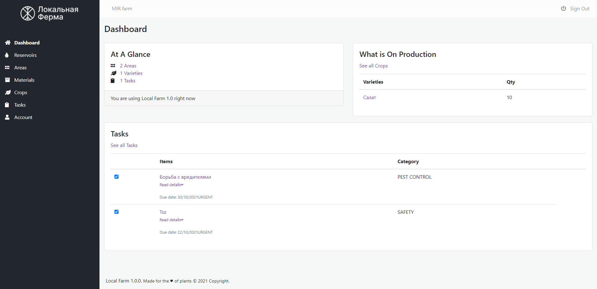

<div align="center">
    
    <h1>Цифровое растениеводство</h1>
    <a href="https://t.me/mirlocalfarm"></a>
    
    <a href="https://opensource.org/licenses/Apache-2.0" target="_blank"></a>
</div>

# Внимание

Это ветка разработки проекта Локальная Ферма. Изменения могут происходить ежедневно. Если вам нужна стабильная версия, вы можете открыть [эту ветку](https://github.com/mir-one/localfarm/tree/master).

---

**Локальная Ферма** - программное обеспечение для прогрессивного растениеводства с открытым исходным кодом. Управляйте агробизнесом, контролируйте уровень воды в резервуарах, составляйте списки задач, отслеживайте запасы и прогресс выращивания растений. Локальная ферма подходит для закрытых и открытых типов ферм.

Скачайте Локальную Ферму для Windows x64 и Linux x64 на [странице релиза](https://github.com/mir-one/localfarm/releases/tag/1.0.0).



## Оглавление

* [Начало](#Начало)
    * [Требования](#Требования)
    * [Инструкции по сборке](#Инструкции-по-сборке)
    * [Ядро СУБД](#Ядро-СУБД)
    * [Запуск тестирования](#Запуск-тестирования)
* [REST APIs](#rest-apis)
* [Дорожная карта](#Дорожная-карта)
* [Вклад в проект](#Вклад-в-проект)
    * [Локализация](#localisation)
* [Поддержка](#support-us)
    * [Backers](#backers)
    * [Sponsors](#sponsors)
* [Authors](#authors)
* [Copyright and License](#copyright-and-license)

## Начало

Это программное обеспечение создано на языке программирования [Go](https://golang.org). Это означает, что вы получите исполняемый двоичный файл для запуска на вашем компьютере. Вам **не нужно** дополнительное программное обеспечение, такое как MAMP, XAMPP или WAMP для запуска проекта **Локальная Ферма**, но вам может потребоваться база данных MySQL, если вы решите использовать ее вместо SQLite *(база данных по умолчанию).*

Если ваша ОС не указана на странице релизов, вам придется самостоятельно собрать проект Локальная Ферма для своей ОС. Вы можете следовать нашим инструкциям по сборке **Локальной Фермы**. 

### Требования
- [Go](https://golang.org) >= 1.11
- [NodeJS](https://nodejs.org/en/) 8 or 10

### Инструкции по сборке
1. Запустите команду `git clone https://github.com/mir-one/localfarm.git`
2. Проверьте текущую версию `git checkout tags/1.0.0 -b v1.0.0`
3. Из корневого каталога проекта запустите команду `go get`, для установки зависимостей Go.
4. Создайте файл `conf.json` используя значения из `conf.json.example` и измените его под ваши требования.
5. Выполните `npm install`, чтобы установить зависимости Vue.js. 
6. Чтобы собрать Vue.js, просто запустите `npm run dev` для разработки или `npm run prod` для рабочих целей. 
7. Скомпилируйте исходный код с помощью `go build`. Команда создаст `localfarm.exe` (для Windows) или` localfarm` (для Linux и OSX).
8. Запустите программу в терминале (для Linux и OSX) `./Localfarm`, или в командной строке Windows `.\Localfarm.exe`. 
9. По-умолчанию установлен пароль и логин `localfarm / localfarm`.

### Ядро СУБД

Локальная Ферма использует SQLite в качестве базы данных по-умолчанию. Вы можете использовать MySQL в качестве базы данных, заменив `sqlite` на `mysql` в поле `localfarm_persistence_engine` в вашем `conf.json'. 

```
{
  "app_port": "8080",
  "localfarm_persistence_engine": "sqlite",
  "demo_mode": true,
  "upload_path_area": "uploads/areas",
  "upload_path_crop": "uploads/crops",
  "sqlite_path": "db/sqlite/localfarm.db",
  "mysql_host": "127.0.0.1",
  "mysql_port": "3306",
  "mysql_dbname": "localfarm",
  "mysql_user": "root",
  "mysql_password": "root",
  "redirect_uri": [
      "http://localhost:8080",
      "http://127.0.0.1:8080"
  ],
  "client_id": "f0ece679-3f53-463e-b624-73e83049d6ac"
}
```

### Запуск тестирования
- Используйте `go test ./...` для запуска всех тестов Go .
- Используйте `npm run cypress:run` для выполнения сквозного теста 

## REST APIs
**Локальная Ферма** используем REST API для простой интеграции с любым программным обеспечением, вы даже можете создать для него клиентское мобильное приложение. Импортируйте файл JSON из каталога Postman в [Postman app](https://www.getpostman.com).

## Дорожная карта
Мы хотим поделиться нашей дорожной карты, чтобы другие могли видеть наши приоритеты в разработке Локальной Фермы. Вы можете прочитать нашу дорожную карту в [Wiki](https://github.com/mir-one/localfarm/wiki/Roadmap).

## Вклад в проект
We welcome contributions, but request you to follow these [guidelines](contributing.md).

### Локализация

You can help us to localise LocalFarm into your language by following these steps:

1. Copy `languages/template.pot` and paste it to `languages/locale` directory.
2. Rename it with your language locale code e.g: `en_AU.po`, `de_DE.po`, etc.
3. Fill `msgstr` key with your translation. You can edit the `.po` file by using text editor or PO Edit software.
4. Pull request your translation to the `master` branch.

### Build LocalFarm localisation by yourself

**Note:** You will need to install GNU Gettext for your OS. Get it [here](https://www.gnu.org/software/gettext/).

You can build LocalFarm in your language by changing the default language inside `resources/js/app.js`.

```
Vue.use(GetTextPlugin, {
  availableLanguages: { // добавьте ваш язык здесь
    en_GB: 'British English',
    id_ID: 'Bahasa Indonesia',
    hu_HU: 'Magyar Nyelv'
  },
  defaultLanguage: 'en_GB', // Измените язык приложения по-умолчанию
  translations: translations,
  silent: false
})
```

Then follow the instruction to [build LocalFarm](#building-instructions).

## Copyright and License

Copyright to LocalFarm and other contributors under [Apache 2.0](https://github.com/mir-one/localfarm/blob/master/LICENSE) open source license.
